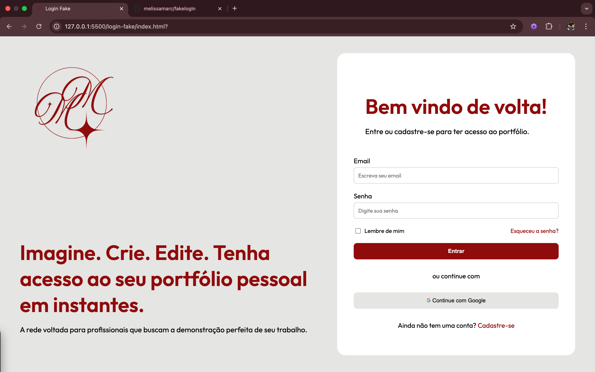

# 🔐 Login Fake – Interface de Autenticação

Este projeto é uma **tela de login fictícia** desenvolvida com **HTML5 e CSS3**, com foco em **layout, organização visual e boas práticas de frontend**, além de atenção à experiência do usuário (UX).

---

## 🖼️ Preview

  

> ⚠️ Este projeto representa apenas a interface visual.  
> Não há lógica de autenticação implementada.

---

## 🛠️ Tecnologias Utilizadas

- HTML5
- CSS3
- Flexbox
- Google Fonts (Outfit, Plus Jakarta Sans)

---

## 📁 Estrutura do Projeto

📦 login-fake
┣ 📂 assets
┃ ┣ logo.png
┃ ┗ google.png
┣ 📂 images
┃ ┗ preview.png
┣ 📜 index.html
┣ 📜 styles.css
┗ 📜 README.md

---

## 🎯 Objetivo do Projeto

- Praticar criação de layouts com Flexbox
- Estruturar formulários corretamente
- Controlar espaçamentos usando `gap`
- Separar responsabilidades entre HTML e CSS
- Aplicar boas práticas de UI e UX

---
